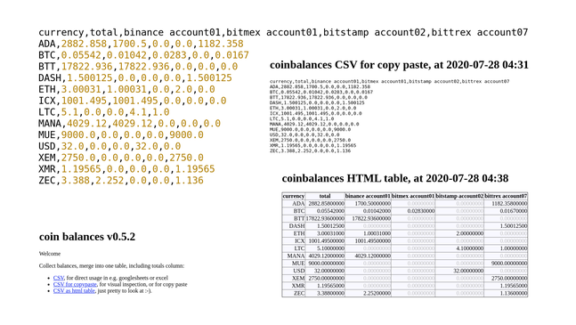

# coinbalances v0.5.2

Pull my balances from 4 exchanges, then serve a combined & summed table as CSV and HTML table, via a simple webserver.

### example outputs
The [examples/](examples/) folder contains one .CSV example, turned into the several outputs that the server generates:


There is a [larger image](examples/example-outputs.png) too, and the source files.

## install and run
### dependencies
```
python3 -m venv env
source env/bin/activate
pip3 install -U pip wheel
pip3 install requests pip bitmex bitmex-ws pandas bottle
```

### API keys and secrets
You are adding your keys to the `auth.json` file, one by one, with this 'questionaire':

    source env/bin/activate
    cd src
    python3 authentication.py
    
That  `auth.json` is human readable, open it in any text editor. 

### security
All this is dangerous; anyone holding your keys, can READ your balances, and perhaps worse things happen. Some -incomplete- ideas how to protect yourself:

* ONLY use READ ONLY keys for API access to your exchanges (so no trading or withdrawal can be done). The `authentication.py` prints some hints which settings to choose when generating the keypair at the exchanges.  
* `chmod 600 auth.json` = to make the file readable only for this user.

You should also read up on how to harden 'bottle apps'. Perhaps not have it listen to 0.0.0.0 but the specific ip address, etc. - whatever you find out, please raise an issue, or make a pull request, to tell us.

Safer is to run the following only locally:

### run app

    source env/bin/activate
    cd src
    python3 app.py
    
then open browser at http://localhost:8080/ (or at your webserver's domain, for the risktakers).

## advanced

### heroku
Be VERY careful. Not sure whether I would trust heroku with my exchange keys. But I wanted to try out if I can make it work. See these instructions: [README_heroku.md](README_heroku.md). Please give feedback, and suggestions; I am new to this.

### extend to more exchanges
Please open an issue if you want to do that. I'd be thrilled to give you some hints. Or if you are a pro, just do it - and please make a pull request then.

### solve some issues


## support me
This was fun, but it also costed a bit of my precious life. Feel free to show me that you like it:

[BTC] 1N65GAaeamWLutNqfXoau8zfYFVjWzh7CU  

Contact me for other currencies. Thank you very much. 

